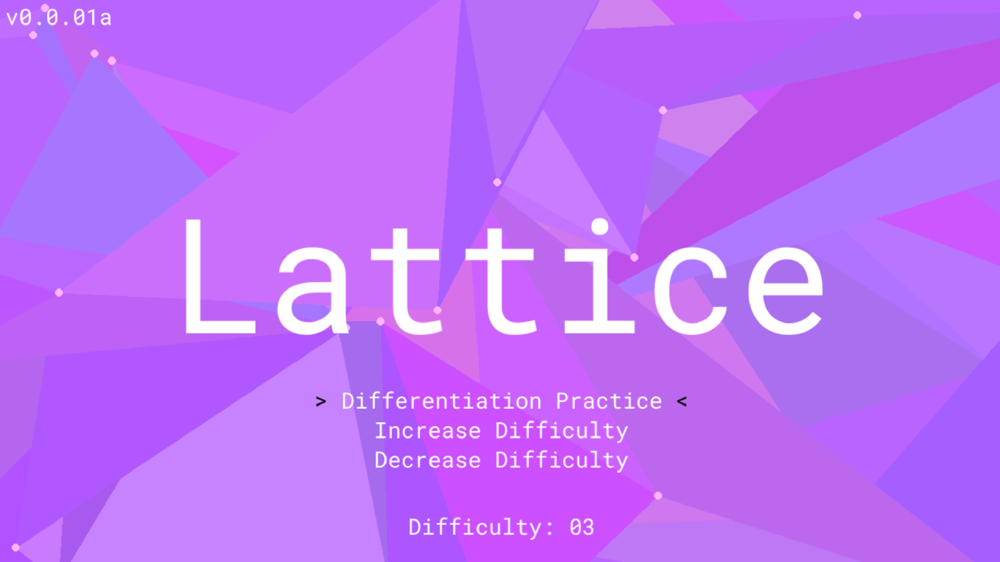

# Lattice: A program for all your A level maths revision needs

Lattice is a program designed to auto generate revision materials for those who study A level maths and A level further maths. I do not intend to support every topic, but just the ones that I and my peers take.

Currently, lattice only supports differentiation practice, but I plan in the near future to add decision mathematics support, as generating questions for that would be very algorithmic (similar to differentiation).

Feel free to contribute!

### To run Lattice:
Running Lattice requires the following:
`python >= 3.12`
`make`
However make can be circumvented by running the commands in the makefile yourself. I plan on adding batch support in the future.

- Firstly, run the following command:
`make virtual_env`
This process can be done without make with:
```sh
mkdir -p cache
python3 -m venv venv/
venv/bin/python3 -m pip install matplotlib sympy pygame pillow
```
- Then, you can run Lattice with the following:
`make`
Or without make installed:
```sh
venv/bin/python3 lattice.py
```

### Notes

This was originally meant to be developed in C++, but I thought to make it more accesible to more people who take A level Computer Science, I chose instead to use python.